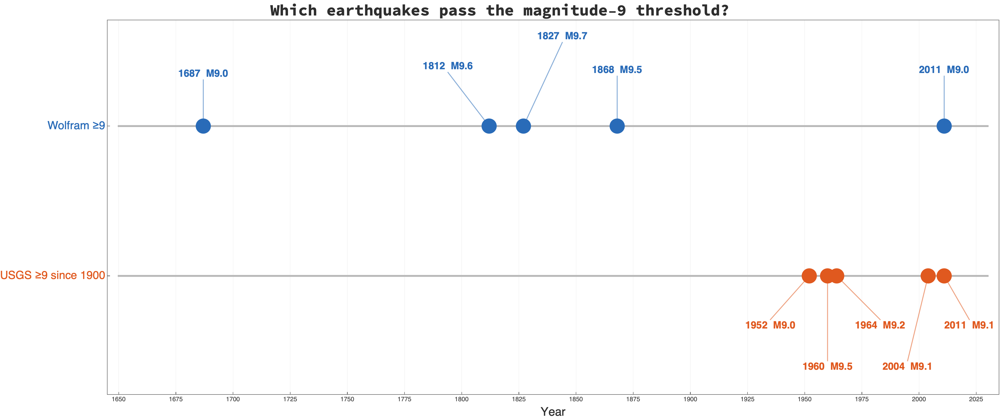
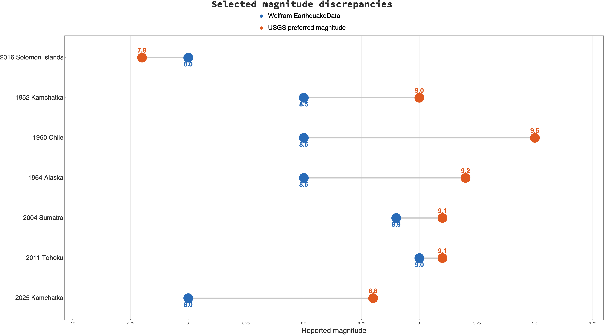

# Revisiting Mathematica's earthquake data: is the magnitude problem fixed?

*Tested with Wolfram Language 15.0.1 on September 4, 2026*

In 2017, seismologist Charles J. Ammon published [“Don’t Study Large Earthquakes with Mathematica’s `EarthquakeData`”](https://sites.psu.edu/charlesammon/2017/05/01/dont-study-large-earthquakes-with-mathematica/). He showed that apparently simple magnitude searches produced a scientifically misleading catalog: questionable historical earthquakes appeared among the largest ever recorded, while several well-established magnitude-9 earthquakes were missing.

Nine years and several Wolfram releases later, I repeated the tests. The short answer is uncomfortable: **the central problem still exists in Wolfram Language 15.0.1**.

The catalog has acquired newer events, but the old anomalous entries and magnitude choices have not been corrected. More importantly, the same problem can be seen in an earthquake from 2025. This is therefore not merely an abandoned historical corner of the database.

## Findings at a glance

| Issue tested | Finding in 2017 | Result in Wolfram Language 15.0.1 | Fixed? | Why it matters |
|---|---|---|---|---|
| Size of the `Magnitude >= 8` result | 253 earthquake records | 265 records; newer events have been appended | **Changed, not a fix** | A larger catalog does not resolve the magnitude-selection problem. |
| Earliest great-earthquake record | Questionable 1096 Japan entry remained in the results | The same 1096 entry is still first | **No** | Very uncertain historical estimates are still treated like modern instrumental magnitudes. |
| 2016 Solomon Islands earthquake | Listed as magnitude 8.0 although USGS preferred magnitude was 7.8 | Still listed as **8.0 Mi**; USGS gives **7.8 Mww** | **No** | The event falls on the wrong side of the magnitude-8 threshold. |
| Historical earthquakes reported at magnitude 9 or greater | Four questionable pre-instrumental events appeared in the `>= 9` result | The same four events remain, with values from 9.0 to 9.7 and no magnitude type | **No** | Unqualified historical estimates dominate a query for the largest earthquakes. |
| 1952 Kamchatka, 1960 Chile, 1964 Alaska, and 2004 Sumatra | All four accepted modern magnitude-9 earthquakes were missing from the `>= 9` result | All four are still excluded because Wolfram stores values from 8.4 to 8.9 | **No** | A search for giant earthquakes omits four canonical examples. |
| Duplicate representation | Catalog consistency was questionable | The 1964 Alaska earthquake appears twice, at 8.5 and 8.4 | **No** | Duplicates can distort counts, plots, and statistical analyses. |
| Consistent magnitude type | Different magnitude measurements were presented as one generic value | Threshold searches still mix `Mi`, moment-based values, and records with a missing type | **No** | Unlike magnitude scales are treated as directly comparable. |
| Recently added data | Not testable in 2017 | The 2025 Kamchatka event is **8.0 Mi** in Wolfram but **8.8 Mww** at USGS | **No; still active** | The issue affects newly added records, not only legacy data. |
| Overall suitability for magnitude-threshold research | Not recommended | Still not scientifically reliable without external validation | **No** | Use USGS, ISC, or Global CMT preferred magnitudes for research-grade selection. |

**Bottom line:** Wolfram has updated the catalog with newer earthquakes, but none of the substantive data-quality problems tested here is fixed. The core failure is still the use of a single generic `Magnitude` field to compare heterogeneous—or unidentified—magnitude types.

## The original test

Ammon began with the following convenient query:

```wolfram
eq8 = EarthquakeData[All, 8.0];
Length[eq8]
```

In 2017 this returned 253 earthquakes. In Wolfram Language 15.0.1 it returns **265**. The earliest entry is still a Japanese earthquake dated 1096; the latest is the July 29, 2025 Kamchatka earthquake.

The return type has changed—the current function returns an association containing each entity and its properties—but the substantive data problem has not.

## The magnitude-9 test still fails

Evaluating

```wolfram
eq9 = EarthquakeData[All, 9.0];
```

returns exactly five events:

| Date | Approximate location | Wolfram magnitude | Wolfram magnitude type |
|---|---|---:|---|
| 1687-10-20 | Southern Peru | 9.0 | Missing |
| 1812-03-26 | Venezuela | 9.6 | Missing |
| 1827-11-16 | Colombia | 9.7 | Missing |
| 1868-08-13 | Northern Chile | 9.5 | Missing |
| 2011-03-11 | Tohoku, Japan | 9.0 | `Mo`-based value shown by Wolfram |

This is essentially the same result criticized in 2017. Four very large historical estimates—with no magnitude type attached—are mixed with one modern, instrumentally constrained earthquake.

Meanwhile, four canonical modern giant earthquakes still do not pass Wolfram's magnitude-9 threshold:

| Earthquake | Wolfram value | Current USGS preferred value |
|---|---:|---:|
| [1952 Kamchatka](https://earthquake.usgs.gov/earthquakes/eventpage/official19521104165830_30) | 8.5 | 9.0 Mw |
| [1960 Chile](https://earthquake.usgs.gov/earthquakes/eventpage/official19600522191120_30) | 8.5 | 9.5 Mw |
| [1964 Alaska](https://earthquake.usgs.gov/earthquakes/eventpage/official19640328033616_30) | 8.5 and a duplicate at 8.4 | 9.2 Mw |
| [2004 Sumatra–Andaman](https://earthquake.usgs.gov/earthquakes/eventpage/official20041226005853450_30) | 8.9 | 9.1 Mw |
| [2011 Tohoku](https://earthquake.usgs.gov/earthquakes/eventpage/official20110311054624120_30) | 9.0 | 9.1 Mww |



The timeline makes the selection failure visible. Wolfram's list is dominated by uncertain pre-instrumental values, while four of the five modern events in the USGS magnitude-9 list are excluded.

## This is a magnitude-type problem, not just a rounding problem

An earthquake can have several valid magnitude measurements because different methods use different parts of the seismic waveform. They should not automatically be placed in one undifferentiated numeric column.

The important types in these tests are:

- **Mw**, moment magnitude, is calculated from seismic moment—the fault area multiplied by average slip and rock rigidity. It is the standard general measure for very large earthquakes because it does not suffer from the same saturation as older amplitude-based scales.
- **Mww** is an Mw solution derived from a long-period W-phase moment-tensor inversion. The USGS treats it as authoritative when it is available.
- **Mi**, also called **Mwp** in the USGS documentation, estimates moment by integrating broadband P-wave displacement. It is a useful rapid estimate, principally over approximately magnitude 5–8, but it is not equivalent to a reviewed Mww value for a giant earthquake.
- **mb**, **Ms**, and **ML** use body waves, surface waves, and local amplitudes respectively. Each has a useful domain, but each can become biased or saturate outside that domain.

The [USGS magnitude-type documentation](https://www.usgs.gov/programs/earthquake-hazards/magnitude-types) explicitly gives different applicability ranges and a preferred processing hierarchy. The [International Seismological Centre's magnitude standards](https://www.isc.ac.uk/standards/magnitudes/) likewise keep these measurement procedures distinct.

`EarthquakeData[All, 8.0]`, however, filters the single numeric `Magnitude` property without requiring a common `MagnitudeType`. Some returned records have a type such as `Mi`; many historical records have no type at all. The query therefore compares measurements that are not scientifically interchangeable.

## The 2016 example remains wrong in the same way

The 2017 article examined the December 8, 2016 Solomon Islands earthquake. The current Wolfram record is:

```text
Time:           2016-12-08 17:38:48 UTC
Position:       10.7° S, 161.4° E
Magnitude:      8.0
Magnitude type: Mi
```

The current [USGS record](https://earthquake.usgs.gov/earthquakes/eventpage/us20007z80) gives **7.8 Mww**. The coordinates and origin time show that these are the same event. Wolfram is still selecting an Mi estimate as its generic magnitude, placing the earthquake on the wrong side of the magnitude-8 threshold.

## A new event shows that the issue is active

The most revealing result is the newest earthquake in the Wolfram magnitude-8 list:

```text
Time:           2025-07-29 23:24:56 UTC
Position:       52.2° N, 160.0° E
Magnitude:      8.0
Magnitude type: Mi
```

The reviewed [USGS event page for the 2025 Kamchatka earthquake](https://earthquake.usgs.gov/earthquakes/eventpage/us6000qw60) gives **8.8 Mww**.

An eight-tenths difference is enormous on a logarithmic magnitude scale. In terms of seismic moment, a difference of 0.8 magnitude units corresponds to a factor of roughly

```wolfram
10^(1.5*0.8)
(* 15.85 *)
```

The Mi value may have been a legitimate rapid estimate from a contributing agency. The data-quality failure is using it as the event's generic representative magnitude after a preferred Mww solution exists.



## A broader count gives another warning

Restricting the Wolfram magnitude-8 results to 1900 and later produces **178 records**. The equivalent current [USGS catalog query](https://earthquake.usgs.gov/fdsnws/event/1/query?format=geojson&starttime=1900-01-01&minmagnitude=8&orderby=time-asc&limit=20000), using USGS preferred magnitudes, returns **100 records**.

The counts are not by themselves a complete catalog comparison: agencies may represent duplicate origins differently, and preferred historical magnitudes can be revised. But a discrepancy this large, combined with the specific mismatches above and a duplicated Alaska record, confirms that the Wolfram query is not equivalent to a scientifically curated list of Mw ≥ 8 earthquakes.

## Reproducing the checks

The following Wolfram Language code reproduces the core local tests. `TimeZoneConvert` is important because `EarthquakeData` returns `DateObject` values in the system time zone.

```wolfram
eq8 = Values @ EarthquakeData[All, 8.0];
eq9 = Values @ EarthquakeData[All, 9.0];

propertyValue[a_, name_] :=
  Values[a][[First @ FirstPosition[ToString /@ Keys[a], name]]];

row[a_] := <|
  "TimeUTC" -> TimeZoneConvert[propertyValue[a, "Period"], 0],
  "Identifier" -> propertyValue[a, "Identifier"],
  "Magnitude" -> propertyValue[a, "Magnitude"],
  "MagnitudeType" -> propertyValue[a, "MagnitudeType"],
  "Position" -> propertyValue[a, "Position"]
|>;

Length[eq8]
row /@ eq9
```

The figures in this post were also generated in Wolfram Language; the source is in [`generate_figures.wl`](generate_figures.wl).

## Conclusion

Ammon's narrow claim survives retesting: **Wolfram's `EarthquakeData` should not be used as a scientifically authoritative catalog for magnitude-threshold studies.**

The function remains convenient for demonstrations, rough mapping, and examples of entity-based computation. But its generic `Magnitude` field combines heterogeneous scales, retains questionable historical estimates, omits magnitude types for crucial records, and sometimes fails to adopt reviewed moment magnitudes even for recent major earthquakes.

For research or teaching where the selection itself matters, query a seismological authority directly—such as the [USGS Earthquake Catalog](https://earthquake.usgs.gov/earthquakes/search/), the [International Seismological Centre](https://www.isc.ac.uk/), or the [Global CMT Catalog](https://www.globalcmt.org/)—then use Wolfram Language for importing, analysis, and visualization.

## Sources

1. Charles J. Ammon, [“Don’t Study Large Earthquakes with Mathematica’s `EarthquakeData`”](https://sites.psu.edu/charlesammon/2017/05/01/dont-study-large-earthquakes-with-mathematica/), May 1, 2017.
2. U.S. Geological Survey, [Magnitude Types](https://www.usgs.gov/programs/earthquake-hazards/magnitude-types).
3. U.S. Geological Survey, [ANSS Comprehensive Earthquake Catalog documentation](https://earthquake.usgs.gov/data/comcat/).
4. International Seismological Centre, [IASPEI standard procedures for magnitude determination](https://www.isc.ac.uk/standards/magnitudes/).
5. U.S. Geological Survey, [M ≥ 8 catalog query from 1900 onward](https://earthquake.usgs.gov/fdsnws/event/1/query?format=geojson&starttime=1900-01-01&minmagnitude=8&orderby=time-asc&limit=20000).
