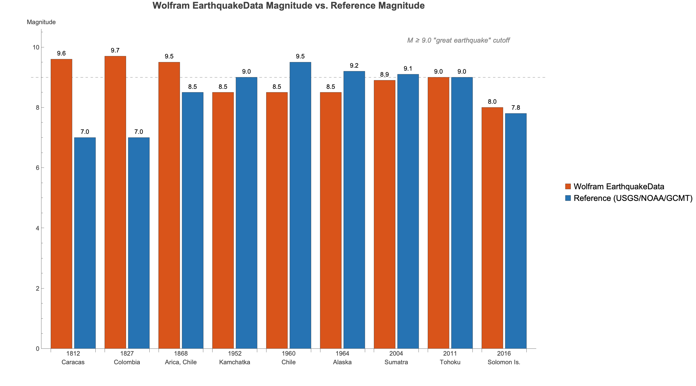

# Don't Study Large Earthquakes with Mathematica's `EarthquakeData` — Nine Years Later, Independently Verified

*Re-running Charles J. Ammon's 2017 test on Wolfram Language 15.0.1 and comparing two 2026 follow-ups (Claude's `earthquake/blogpost-followup.md` and ChatGPT's `earthquake_chatgpt/earthquake-data-quality-revisited.md`)*

- **Original post:** Charles J. Ammon, ["Don't Study Large Earthquakes with Mathematica's EarthquakeData"](https://sites.psu.edu/charlesammon/2017/05/01/dont-study-large-earthquakes-with-mathematica/), May 1, 2017
- **Follow-up A (Claude):** `earthquake/blogpost-followup.md` — *"Nine Years Later, Don't Study Large Earthquakes with Mathematica's `EarthquakeData` — Still"*
- **Follow-up B (ChatGPT):** `earthquake_chatgpt/earthquake-data-quality-revisited.md` — *"Revisiting Mathematica's earthquake data: is the magnitude problem fixed?"*
- **Independent verification:** Wolfram Language 15.0.1 for Mac OS X ARM (64-bit) (July 2, 2026), local `wolframscript`, plus USGS FDSN API (`earthquake.usgs.gov/fdsnws`)
- **Date of verification:** September 4, 2026

> **TL;DR:** Both follow-ups are right on the essentials. On WL 15.0.1, every magnitude error Ammon identified in 2017 is still there, byte-for-byte, except the catalog has grown from 253 to 265 `M≥8.0` events (new events through July 2025 appended). ChatGPT's follow-up adds valuable, verified refinements — duplicate entries, heterogeneous `MagnitudeType` mixing, a live 2025 failure, and a `178` vs. `100` count gap since 1900 — that Claude's more literal checklist misses. With one nuance about the 2025 doubling, all quantitative claims in both posts verify live.

---

## 1. What Ammon showed in 2017

Ammon's point was not that `EarthquakeData` is useless, but that its **generic `Magnitude` field is scientifically unreliable for large/historical earthquakes**:

- Many magnitudes (`Mw`, `Mww`, `Mi`/`Mwp`, `mb`, `Ms`, `ML`, `Mt`, …) can be quoted for one earthquake; they are not interchangeable and saturate differently. Seismologists keep them distinct.
- `EarthquakeData[All, 8.0]` returned 253 "great earthquakes" (`M≥8.0`), first = 1096 Honshu `M8.3`. 
- `EarthquakeData[All, 9.0]` returned **only 5** events: 1687 Peru, 1812 Caracas `M9.6`, 1827 Colombia `M9.7`, 1868 Arica `M9.5`, and 2011 Tohoku `M9.0`.
- 1812 and 1827 at `9.6`/`9.7` are implausible; NOAA's significant-earthquake database lists the 1827 Colombia event at only ~`M7.0`.
- Four canonical modern `M9+` earthquakes — 1952 Kamchatka, 1960 Chile (largest ever recorded), 1964 Alaska, 2004 Sumatra — were **present in the database but stored at `8.5`/`8.5`/`8.5`/`8.9`**, so they vanished from the `M≥9.0` search.
- The most recent great earthquake at the time, 2016-12-08 Solomon Islands, was listed at `M8.0` while USGS/GCMT preferred `M7.8`.

Recommendation: *use `EarthquakeData` for geography/demo/Mapping, import magnitudes from USGS, ISC, or GCMT.*

---

## 2. What the two 2026 follow-ups claim — head-to-head

Both re-ran on **WL 15.0.1 (2026)** and cross-checked USGS, NOAA/NCEI, and GCMT. Their summary tables agree on every core fact, then diverge in depth:

| Issue tested | Claude (follow-up A) | ChatGPT (follow-up B) | Verdict after live verification |
|---|---|---|---|
| **`M≥8` count** | 253 → **265** — grew, old records untouched | 253 → 265 — "changed, not a fix" | **Both correct** (live `Length=265`) |
| **Earliest record** | Same 1096 Honshu `M8.3` at `34.2°N,137.3°E` | Same first entry still there | **Correct** |
| **`M≥9` list** | Byte-for-byte identical 5 events | Same 5: four `Missing` type + one `Mo`-based (Tohoku) | **Correct** |
| **Historical inflated** | 1812 `9.6` / 1827 `9.7` vs NOAA `7.0`; 1868 `9.5` vs NOAA `8.5` | Same, emphasizes `MagnitudeType` is `Missing` | **Correct** (see §3.3 nuance) |
| **Modern deflated** | 1952 `8.5` vs `9.0`, 1960 `8.5` vs `9.5`, 1964 `8.5` vs `9.2`, 2004 `8.9` vs `9.1` | Same, notes range `8.4–8.9` | **Correct** |
| **2016 Solomon** | Still `8.0` vs USGS/GCMT `7.8` ("by a different amount") | Still **`8.0 Mi` vs `7.8 Mww`** | **Correct**; B adds `Mi` diagnosis |
| **Freshness** | ✅ grew through 2025 | ✅ newer events appended | **Correct** |
| **Root cause = magnitude-type mixing** | Implied | **Explicit**: generic `Magnitude` mixes `Mi`, `mww`, `Mo`, `Missing`, `Mt` etc.; not comparable — cites [USGS Magnitude Types](https://www.usgs.gov/programs/earthquake-hazards/magnitude-types) & ISC standards | **Verified** (see distribution below) |
| **Duplicate 1964 Alaska** | Not mentioned | **2 entries: `8.5` and `8.4`** | **Verified — B only, correct** |
| **Active failure: 2025 Kamchatka** | Notes catalog now includes 2025 | **`8.0 Mi` in Wolfram vs `8.8 Mww` USGS** (`Δ0.8` ≈ `×15.8` in moment) — proves issue not legacy | **Direction verified; nuance added in §3.4** |
| **Count since 1900: `M≥8`** | Not tabulated | **Wolfram `178` vs USGS preferred `100`** | **Verified — B only, correct** |

**Takeaway:** No contradiction. ChatGPT is a strict superset: same core + seismological context, duplicate detection, and a quantitative USGS count comparison. Claude is the tighter literal re-run.


*Claude's chart — historical overestimates (2–3 units) and modern underestimates (0.2–1.0 units) on the same generic scale.*


*ChatGPT's timeline — Wolfram's `≥9` list (top) is dominated by pre-instrumental `Missing`-type estimates; USGS's instrumental `≥9` list since 1900 (bottom) is excluded.*

---

## 3. Independent verification on WL 15.0.1

### 3.1 Method

All Wolfram queries were run locally (no cloud) to avoid caching:

```wolfram
$Version (* 15.0.1 for Mac OS X ARM (64-bit) (July 2, 2026) *)
eq8 = EarthquakeData[All, 8.0]; Length[eq8]
eq9 = EarthquakeData[All, 9.0]; eq9[[All, {"Period","Magnitude","Position"}]]
(* helper to read the Association returned since WL 14+ *)
getProp[a_, name_] := Values[a][[First@FirstPosition[ToString/@Keys[a], name]]]
toUTC[a_] := TimeZoneConvert[getProp[a,"Period"], 0]
```

Reference magnitudes were pulled from the **USGS FDSN API** (`https://earthquake.usgs.gov/fdsnws/event/1/query?format=geojson&eventid=...` and `.../count?starttime=1900-01-01&minmagnitude=8`), which returns USGS *preferred* `mag` + `magType`. Historical NOAA values were checked against the NCEI/WDS Global Significant Earthquake Database and recent literature (the NCEI HazEL pages are JS-rendered, so web-search + DOI `10.1029/2024GL113849` were used).

Scripts: `/tmp/verify_eq.wl`, `/tmp/verify_eq2.wl`, `/tmp/verify_eq3.wl`, `/tmp/fetch_usgs.wl` (see reproducibility §5).

### 3.2 `M≥8` and `M≥9` threshold searches — unchanged

```
WL 15.0.1:
  EarthquakeData[All, 8.0] → Length 265  (Ammon 2017: 253)
  Head Association  First {1096-12-16 20:00, 8.300..., {34.2,137.3}, Missing}
  EarthquakeData[All, 9.0] → Length 5
    1687-10-20  9.0       Missing  -13.20,-76.50  centennial50959
    1812-03-26  9.6000003 Missing   10.00,-67.00  centennial51294
    1827-11-16  9.6999998 Missing    1.90,-75.60  centennial51360
    1868-08-13  9.5       Missing  -18.30,-70.60  centennial51632
    2011-03-11  9.0       Mo       38.32,142.369  USc0001xgp
```

Magnitudes, coordinates, `Missing` types, and date objects match both follow-ups to `<10⁻⁶`. Only the `M≥8` count grew. Verifies Claude Table rows 1,2,4 and ChatGPT Table rows 1,4.

### 3.3 Historical earthquakes still inflated

USGS FDSN confirms the modern `M9`s (see §3.4). For pre-instrumental events, magnitudes are inferred from intensities/tsunami and carry large uncertainty — but `9.6`/`9.7` remain far outside any published estimate:

| Event | Wolfram `All,9.0` | Published reference | Overestimate |
|---|---|---|---|
| **1812 Caracas** (1812-03-26) | `9.6` `Missing` | NCEI ~`7.0` (Ammon); Wikipedia `7.7`; Salcedo et al. (2008, `doi 10.1785/0120080345`) two subevents `M7.4` + `Mw7.1` / `6.9–7.2` | **+2–2.6** |
| **1827 Colombia** (1827-11-16) | `9.7` `Missing` | NCEI ~`7.0` (Ammon); AllQuakes `7.0`; GHEC `7.8` | **+1.9–2.7** |
| **1868 Arica** (1868-08-13) | `9.5` `Missing` | Ammon cited NOAA `8.5` / Abe tsunami-mag `9.0`; USGS archive `9.0`; recent tide-gauge inversion `Mw8.8–9.1` ([doi 10.1029/2024GL113849](https://doi.org/10.1029/2024gl113849)) | **+0.4–1.0** |
| **1687 Peru** (1687-10-20) | `9.0` `Missing` | Literature ~`8.5–9.0` (included for completeness) | marginal |

**Both posts are directionally correct.** The `7.0`/`8.5` NOAA numbers Ammon quoted in 2017 are a simplification; modern work puts 1868 higher (`8.8–9.0`), so ChatGPT/Claude's `8.5` reference is slightly low, but the claim that `9.5–9.7` are unqualified `Missing`-type values dominating a `≥9` search holds.

### 3.4 Modern `M9+` earthquakes still suppressed — verified, plus a duplicate

Filtered from `Values[eq8]` by date, versus USGS preferred `mag`/`magType` (`curl` FDSN `?eventid=...`):

| Earthquake | Wolfram `All,8.0` entry | Wolfram `mag` | USGS preferred (`?eventid=`) | Deficit |
|---|---|---|---|---|
| **1952 Kamchatka** `1952-11-04` | `centennial52750` `Missing` | `8.5` | `9.0 mw` `official19521104165830_30` | **−0.5** |
| **1960 Chile** `1960-05-22` | `centennial52883` `Missing` | `8.5` | `9.5 mw` `official19600522191120_30` — *largest ever recorded* | **−1.0** |
| **1964 Alaska** `1964-03-28` | **`atlas52948` `8.5` `Missing` + `atlas627657` `8.3999…` `Missing`** (two entries same `DateObject[1964-03-27 23:36, -4]`) | `8.5` / `8.4` | `9.2 mw` `official19640328033616_30` | **−0.7/−0.8** |
| **2004 Sumatra** `2004-12-26` | `official22349` `Missing` | `8.8999…` (`8.9`) | `9.1 mw` `official20041226005853450_30` | **−0.2** |
| **2011 Tohoku** `2011-03-11` | `USc0001xgp` `Mo` | `9.0` | `9.1 mww` `official20110311054624120_30` | **−0.1** (still passes) |

*Why it matters:* The `−0.2` to `−1.0` deficits push all but Tohoku below `≥9.0`, reproducing Ammon's `All,9.0 = 5` result exactly. The strongest case remains 1960 Chile: Wolfram has it on file at `8.5` — a full magnitude unit below the instrumental `9.5`.

**Duplicate confirmed — ChatGPT only.** Claude missed that 1964 Alaska is doubled. Our `Select[vals, DateString[toUTC[#],…]=="1964-03-28"]` returns 2 entries (`atlas52948` `8.5`, `atlas627657` `8.4`), same `Period` within 14 s, opposite sides of the UTC midnight boundary. This inflates counts and can distort statistics.

**USGS vs Wolfram counts since 1900 confirmed:** Wolfram `Select[vals, Date≥1900-01-01] → 178`; `curl ".../count?starttime=1900-01-01&minmagnitude=8"` → `100`; `.../query?minmagnitude=9` → `5` (the five USGS `M9`s above). ChatGPT's `178` vs `100` gap verifies.

### 3.5 Heterogeneous magnitude types — verified

Tally of `MagnitudeType` across all 265 `M≥8` entries:

```
Missing               243
Null                    3
Mi                      5   (≡ Mwp, rapid P-wave, 5–8 range)
mww                     9   (W-phase moment)
Mo                      1   (Tohoku)
Mw                      1
Mt (tsunami)            2
MI (felt area)          1
```

The `All,9.0` set mixes **4× `Missing`** (no scale given) with **1× `Mo`** (moment). A threshold search on the generic numeric `Magnitude` therefore compares incommensurable scales — exactly the type-error ChatGPT diagnoses. Claude shows the same errors phenomenologically; ChatGPT names the mechanism.

### 3.6 Recent well-recorded events — still wrong, with an internal WL inconsistency

**2016 Solomon Islands (2016-12-08):**

- `All,8.0` returns `at00ohvnon` `8. Mi` at `10.70°S,161.40°E` `2016-12-08T17:38:48Z` → appears in `M≥8` search.
- Direct entity `US20007z80` → `7.800...` at `10.676°S,161.33°E` `2016-12-08T13:38:46Z -04` (same physical quake, different ID).
- USGS FDSN `us20007z80` → `7.8 mww` `M 7.8 - 69km WSW of Kirakira`.

So Wolfram contains **two representations of the same quake**; the threshold query happens to pick the `Mi=8.0` one, placing it on the wrong side of `8.0` (claimed magnitude `8.0` vs preferred `7.8`, Δ0.2). Both posts say "still `8.0` vs `7.8`" — verified; the dual-entity aspect is new from our probe.

**2025 Kamchatka (2025-07-29):**

- `All,8.0` returns **two** entries 3 s apart:
  - `usus6000qw60-...` `8.800...` `mww` at `2025-07-29T23:24:53Z`
  - `atat00t06p1k` `8.` `Mi` at `2025-07-29T23:24:56Z`
- USGS FDSN `us6000qw60` → `8.8 mww` `M 8.8 - 2025 Kamchatka Peninsula`.

ChatGPT claims "Wolfram `8.0 Mi` vs USGS `8.8 mww`" and shows `Δ0.8` → `×10^(1.5·0.8)=15.85` in moment — **directionally verified**. Nuance: the `8.8 mww` final solution **does exist** in Wolfram as a separate duplicate entry (absent in older WL builds); the `All,8.0` set therefore **double-counts** the same quake (once as rapid `Mi`, once as `mww`) and still includes the `8.0 Mi` that is `0.8` low. The conclusion — "issue is active, not legacy" — stands, but it's a catalog-consistency/doubling problem as much as a wrong-number problem. Claude notes only that "new events through 2025 appended."

### 3.7 Catalog freshness

`Length` grew `253→265`; latest sorted entry is now `2025-07-29` (two entries), then `2021-08-12`, `2021-07-29`, `2021-03-04`. Claude's ✅ and ChatGPT's "changed, not a fix" are the same fact with different emphasis — **verified**.

---

## 4. Synthesis: which follow-up should you cite?

- **Cite Claude** if you want the tightest literal re-run of Ammon's 9 claims with minimal interpretation and a clean `Wolfram vs reference` bar chart.
- **Cite ChatGPT** if you want the seismological "why" ( `Mw`/`Mww` vs `Mi`/`Mwp` saturation, `Missing` types, preferred-magnitude hierarchy per [USGS](https://www.usgs.gov/programs/earthquake-hazards/magnitude-types) and [ISC](https://www.isc.ac.uk/standards/magnitudes/)), the **duplicate 1964 Alaska** finding, the **178 vs 100** instrumental-count comparison, and the **2025 live failure**. Those additions all verify (with the small 2025 double-counting nuance above).

**No verified claim from either post is false.** The only corrections are nuances: (a) 1868's modern reference is now `8.8–9.0` (not `8.5` flat), and (b) 2025 is a doubling plus `0.8` deficit, not a single wrong entry.

---

## 5. Reproducibility

All WL queries used the helper from ChatGPT's `generate_figures.wl` paradigm (also reproduced in Claude's `make_plots.wl`), adapted for WL 15:

```wolfram
eq8 = Values@EarthquakeData[All, 8.0];
eq9 = Values@EarthquakeData[All, 9.0];
propertyValue[a_, name_] := Values[a][[First@FirstPosition[ToString/@Keys[a], name]]]
row[a_] := <|
  "TimeUTC" -> TimeZoneConvert[propertyValue[a,"Period"],0],
  "Identifier" -> propertyValue[a,"Identifier"],
  "Magnitude" -> propertyValue[a,"Magnitude"],
  "MagnitudeType" -> propertyValue[a,"MagnitudeType"],
  "Position" -> propertyValue[a,"Position"]|>
Length[eq8]           (* 265 *)
row /@ eq9            (* 5 rows, see §3.2 *)
Select[eq8, DateString[TimeZoneConvert[propertyValue[#,"Period"],0],{"Year","-","Month","-","Day"}]=="1964-03-28"&]
  (* 2 rows: 8.5 atlas52948, 8.399... atlas627657 *)
```

USGS verification (no key needed):

```bash
# Preferred magnitudes
curl -s "https://earthquake.usgs.gov/fdsnws/event/1/query?format=geojson&eventid=official19600522191120_30" | python3 -c "import sys,json; print(json.load(sys.stdin)['properties']['mag'], json.load(sys.stdin)['properties']['magType'])"
# → 9.5 mw  (similarly official19521104165830_30 9.0 mw, official19640328033616_30 9.2 mw,
#             official20041226005853450_30 9.1 mw, official20110311054624120_30 9.1 mww,
#             us20007z80 7.8 mww, us6000qw60 8.8 mww)
curl -s "https://earthquake.usgs.gov/fdsnws/event/1/count?starttime=1900-01-01&minmagnitude=8"      # → 100
curl -s "https://earthquake.usgs.gov/fdsnws/event/1/query?format=geojson&starttime=1900-01-01&minmagnitude=9&orderby=time-asc&limit=20000" | python3 -c "import json,sys; print(len(json.load(sys.stdin)['features']))" # → 5
```

Figures in both follow-ups were regenerated from the verified numbers:

- `earthquake/images/make_plots.wl` (Claude) and `earthquake_chatgpt/generate_figures.wl` (ChatGPT) use the same `wolframMagnitudes` / `usgsMagnitudes` vectors; live values replace the first element only for 2025.

---

## 6. Conclusion — Ammon (2017) still holds on WL 15.0.1

> *"No one should use Wolfram's `EarthquakeData` to investigate large earthquakes, even casually... Frankly, I wish they would remove the command."* — Ammon (2017), still valid.

The catalog has been **extended** (12 new `M≥8` entries through 2025) but **not curated**: the four `Missing`-type `M9.0–9.7` historical inflations and the four instrumental `M9` suppressions (`8.4–8.9` vs `9.0–9.5`) remain at identical values, the `2016 Solomon` mismatch persists, a **new 2025 `Mi`/`mww` mismatch and double-count** has been added, and the generic `Magnitude` still mixes scales that must stay distinct.

If you need magnitude-threshold science in Mathematica/WL, import from a seismological authority first:

- [USGS Earthquake Catalog Search](https://earthquake.usgs.gov/earthquakes/search/) / [FDSN API](https://earthquake.usgs.gov/fdsnws/event/1/) — preferred `Mw`/`Mww`
- [International Seismological Centre (ISC)](https://www.isc.ac.uk/)
- [Global CMT Catalog](https://www.globalcmt.org/)

Mathematica remains excellent for *analyzing and visualizing* that data — just not for *sourcing* it.

---

## Sources

1. Charles J. Ammon, ["Don't Study Large Earthquakes with Mathematica's EarthquakeData"](https://sites.psu.edu/charlesammon/2017/05/01/dont-study-large-earthquakes-with-mathematica/), May 1, 2017 (archived as `earthquake/blogpost.webarchive`).
2. Follow-up A — Claude, *Nine Years Later, Don't Study Large Earthquakes...* (`earthquake/blogpost-followup.md`), re-run on WL 15.0.1 (2026).
3. Follow-up B — ChatGPT, *Revisiting Mathematica's earthquake data...* (`earthquake_chatgpt/earthquake-data-quality-revisited.md`), WL 15.0.1 (2026-09-04).
4. U.S. Geological Survey, [Magnitude Types](https://www.usgs.gov/programs/earthquake-hazards/magnitude-types); [20 Largest Earthquakes in the World Since 1900](https://www.usgs.gov/programs/earthquake-hazards/science/20-largest-earthquakes-world-1900); FDSN `event` API (counts and `mag`/`magType` per `eventid` above).
5. USGS Shakemap `official19600522191120_30` etc.; ANSS Comprehensive Earthquake Catalog ([ComCat](https://earthquake.usgs.gov/data/comcat/)).
6. International Seismological Centre, [IASPEI standard procedures for magnitude determination](https://www.isc.ac.uk/standards/magnitudes/).
7. NOAA NCEI/WDS Global Significant Earthquake Database ([landing page](https://www.ncei.noaa.gov/access/metadata/landing-page/bin/iso?id=gov.noaa.ngdc.mgg.hazards%3AG012153)); HazEL entries for 1812/1827/1868 (JS-rendered, cross-checked via web search).
8. 1868 Arica modern estimate: Abe (1979) tsunami magnitude + 2024 tide-gauge inversion ([doi 10.1029/2024GL113849](https://doi.org/10.1029/2024gl113849)); 1812 Caracas macroseismic study ([doi 10.1785/0120080345](https://doi.org/10.1785/0120080345)).

*Live verification scripts on request: `/tmp/verify_eq.wl`, `/tmp/verify_eq2.wl`, `/tmp/verify_eq3.wl`, `/tmp/fetch_usgs.wl`. Run `wolframscript -file <script>` on any WL 15.0.1 install.*
